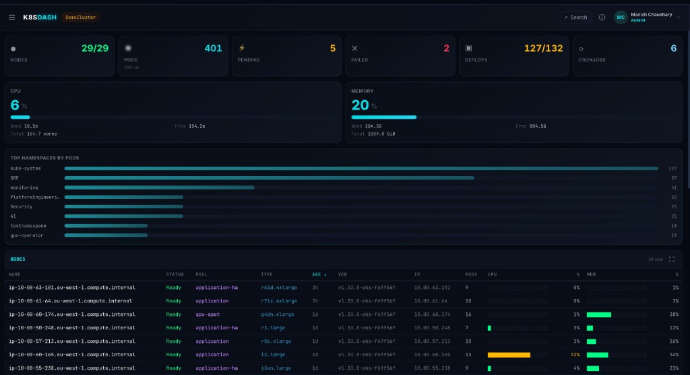
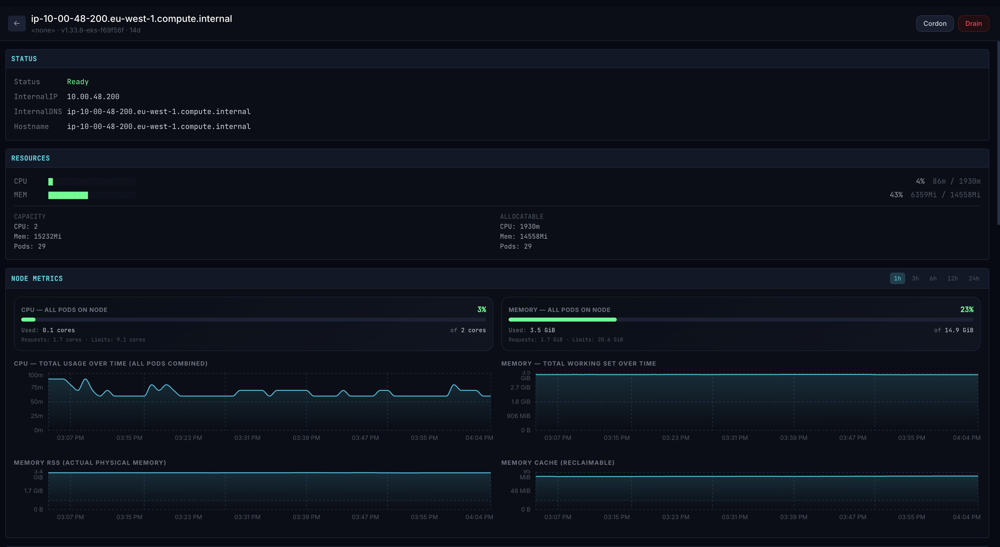
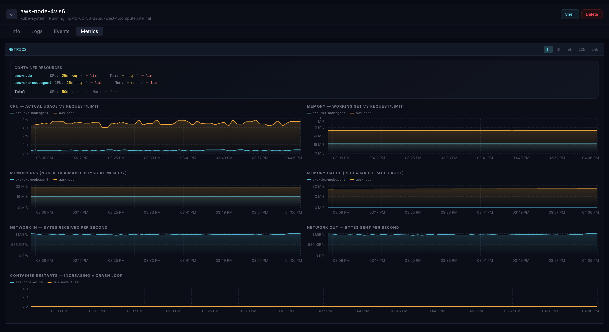
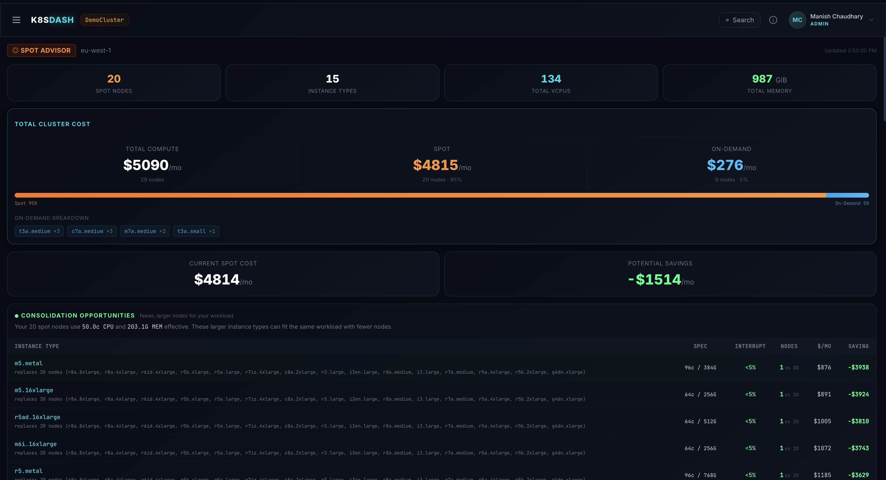

# Kube-Argus

**The real-time Kubernetes dashboard that SREs actually need.** Live cluster state every 10 seconds, streaming pod logs, interactive shell, YAML editor, drain wizard, cost analysis, and AI-powered diagnostics — in a single binary with zero dependencies.


[](https://artifacthub.io/packages/search?repo=kube-argus)

<table>
<tr>
<td width="50%">
<strong>Cluster Overview</strong> — Live node status, CPU/memory utilisation, top namespaces, and resource counts refreshed every 10 seconds.
<br><br>

</td>
<td width="50%">
<strong>Node Detail & Metrics</strong> — kubectl describe-style detail with Prometheus metrics, events, pod list, and admin actions (cordon, drain).
<br><br>

</td>
</tr>
<tr>
<td width="50%">
<strong>Pod Metrics & Logs</strong> — Per-pod CPU/memory graphs, live log streaming, container selector, and AI-powered diagnosis.
<br><br>

</td>
<td width="50%">
<strong>Spot Advisor & Cost Analysis</strong> — Spot instance risk scoring, cluster cost breakdown, and intelligent consolidation recommendations.
<br><br>

</td>
</tr>
</table>

---

## Why Kube-Argus?

Most Kubernetes dashboards show you resources. Kube-Argus gives you a **live, real-time operating picture** of your cluster — what's **happening now**, what it **costs**, and how to **fix** it — with the same immediacy as k9s, but in a web UI you can share with your team and put on a wall screen.

### Lightweight & fast

- **Single binary (~20 MB)** — one Go binary serves the API and the pre-built React frontend; nothing else to install
- **~30 MB Docker image** — Alpine-based, multi-arch (amd64 + arm64), starts in under a second
- **Zero dependencies** — no database, no CRDs, no operators, no agents on worker nodes, no metrics-server requirement
- **Minimal cluster load** — one cached API call per 10-second cycle regardless of how many users are connected; 100 users don't mean 100x API load
- **Deploys in under a minute** — `helm install` or `kubectl apply` and you're running
- **Low resource footprint** — runs comfortably on 100m CPU / 128Mi memory

### Built for real-time operations

- **10-second auto-refresh** — every view updates automatically, no manual reload
- **Live log streaming** — tail pod logs in real-time via Server-Sent Events, with container selector and init container support
- **Aggregated workload logs** — stream logs from all pods of a Deployment/StatefulSet/DaemonSet into one color-coded view
- **Interactive web shell** — exec into any pod over WebSocket, full xterm.js terminal in the browser
- **Pod sparklines** — inline CPU/MEM trend charts in the pods table, updated every 10 seconds
- **Instant action feedback** — cordon, drain, restart, scale, and delete trigger immediate cache refresh so you see the result in seconds, not minutes
- **Streaming AI diagnosis** — LLM responses stream token-by-token as they're generated
- **Troubled pods view with fullscreen mode** — dedicated NOC screen for wall-mounted monitors showing CrashLoopBackOff, OOMKilled, Pending pods live
- **Drain wizard** — preview affected pods with PDB awareness before draining, with real-time SSE streaming progress
- **YAML viewer/editor** — view and edit raw YAML for 11 resource kinds directly from the dashboard
- **Config drift detection** — identify pods running stale ConfigMaps/Secrets after changes

### Feature comparison

| Capability | Kube-Argus | K8s Dashboard | Lens | Headlamp | k9s |
|---|:---:|:---:|:---:|:---:|:---:|
| Single binary, zero dependencies | **Yes** | Needs metrics-server | Desktop app | Needs plugins | Terminal app |
| Docker image size | **~30 MB** | ~250 MB | ~500 MB | ~200 MB | N/A |
| Startup time | **< 1s** | ~10s | ~5s | ~5s | < 1s |
| Per-user API load | **None (shared cache)** | Per-user | Per-user | Per-user | Per-user |
| Live auto-refresh (10s cycle) | **Yes** | Manual | Yes | Yes | **Yes** |
| Streaming pod logs (SSE) | **Yes** | — | Yes | Yes | **Yes** |
| Web terminal (exec into pods) | **Yes** | — | Yes | Yes | Terminal-native |
| Spot instance cost analysis & consolidation | **Yes** | — | — | — | — |
| AI-powered pod diagnosis (any LLM) | **Yes** | — | — | — | — |
| Resource right-sizing recommendations | **Yes** | — | — | — | — |
| Topology spread constraint validation | **Yes** | — | — | — | — |
| Namespace-level cost allocation | **Yes** | — | — | — | — |
| Prometheus metrics (node, pod, workload) | **Yes** | — | Partial | — | — |
| Workload dependency graph | **Yes** | — | — | — | — |
| PDB status inline on workloads | **Yes** | — | — | — | — |
| Drain wizard with PDB preview & streaming | **Yes** | — | — | — | — |
| YAML view/edit (11 resource kinds) | **Yes** | — | Yes | Yes | **Yes** |
| Config drift detection | **Yes** | — | — | — | — |
| Pod sparklines (CPU/MEM trends) | **Yes** | — | — | — | — |
| Aggregated workload logs | **Yes** | — | — | — | — |
| Storage dashboard (PVC/PV/StorageClass) | **Yes** | Partial | Yes | Partial | **Yes** |
| Audit trail & online users | **Yes** | — | — | — | — |
| Node pod heatmap (noisy neighbors) | **Yes** | — | — | — | — |
| Spot interruption resilience scoring | **Yes** | — | — | — | — |
| Troubled pods / NOC screen mode | **Yes** | — | — | — | — |
| Web-based (sharable, no install) | **Yes** | Yes | No | Yes | No |
| Open source (Apache 2.0) | **Yes** | Yes | Freemium | Yes | Yes |

**In short**: Kube-Argus gives you k9s-level real-time visibility in a web UI, plus cost optimisation and AI diagnostics — all in a ~30 MB image that deploys in under a minute with no CRDs, no databases, no agents.

### Works on

| Platform | Support Level | Notes |
|----------|:---:|---|
| **Amazon EKS** | Full | All features including Spot Advisor, cost analysis, and spot interruption tracking |
| **Google GKE** | Core + Metrics | All features except Spot Advisor (GCP Spot VMs use different APIs) |
| **Azure AKS** | Core + Metrics | All features except Spot Advisor (Azure Spot VMs use different APIs) |
| **Minikube / kind / k3s** | Core | All features except cloud-specific cost analysis and spot features |
| **Self-managed / on-prem** | Core + Metrics | Full functionality with Prometheus; no cloud cost features |

> Spot Advisor and cost analysis are currently EKS-specific. Cloud-agnostic support for GCP and Azure spot instances is on the roadmap.

---

## Features

### Cluster Overview
- **Live cluster state refreshed every 10 seconds** — no manual reload needed
- Node status (Ready, NotReady, Draining, Cordoned) with k9s-style transitions
- Cluster-wide CPU and memory utilisation at a glance
- Warning counts and top resource consumers by namespace

### Node Management
- All nodes with status, instance type, capacity, allocatable resources, and age
- Click any node for `kubectl describe`-style detail with live events (Karpenter, spot interruptions, drain failures)
- **Drain wizard** — preview which pods will be evicted, check PDB budgets, and stream progress in real-time
- **Pod heatmap** — "noisy neighbors" visualization showing per-pod resource usage on a node
- **Admin actions**: cordon, uncordon, drain — with instant feedback
- Per-node Prometheus metrics: CPU, memory, disk, and network

### Workloads
- Deployments, StatefulSets, DaemonSets, Jobs, and CronJobs in one filterable view
- **Restart and scale** directly from the workload detail page
- **Aggregated logs** — stream logs from all pods of a workload in one color-coded view
- ReplicaSet history (last 5) inside Deployments
- Rolling update strategy details (maxSurge, maxUnavailable, partition)
- PodDisruptionBudget (PDB) status badges inline on workload rows
- Prometheus CPU and memory metrics with selectable time ranges (1h, 6h, 12h, 24h)
- Resource right-sizing recommendations based on 7-day average usage
- Interactive dependency graph with **config drift** detection (stale ConfigMaps/Secrets highlighted)

### Pod Management
- All pods with phase, restarts, resource usage bars, and node placement
- **Table and card views** with search, status filters, owner filters, and sortable columns
- **Pod sparklines** — inline CPU/MEM trend charts updated every 10 seconds
- **Owner navigation** — click through from pod to parent Deployment/StatefulSet/DaemonSet
- **Live log streaming** with container selector (including init containers)
- **Previous container logs** — view logs from crashed/restarted containers
- **Interactive web shell** — exec into any pod directly from the browser
- **AI-powered diagnosis** for unhealthy pods (streams response in real-time)
- Health probe details (liveness, readiness, startup) and last termination info
- Per-pod CPU and memory metrics

### Networking
- Services (ClusterIP, NodePort, LoadBalancer) with ports and selectors
- Ingress rules with hosts, paths, TLS status, and backend services

### Storage
- **PersistentVolumeClaims** with status, capacity, StorageClass, and bound PV details
- **PersistentVolumes** with reclaim policy and capacity
- **StorageClasses** with provisioner and parameters
- Expandable rows showing pod-to-PVC mapping

### Configuration
- ConfigMaps and Secrets with last-modified timestamps
- **Config drift detection** — identify when a ConfigMap or Secret has been modified but pods are still running the old version
- Data key inspection (Secrets are masked)

### Cost & Optimisation
- **Spot Advisor**: Spot instance risk analysis with intelligent consolidation suggestions
- **Cost Allocation**: Namespace-level and nodepool-level cost breakdown
- **Total Cluster Cost**: Aggregated cost panel

### Topology Spread Analysis
- Validates workloads against their topologySpreadConstraints
- Shows violations grouped by topology key (zone, hostname, instance-type)
- Distinguishes soft (ScheduleAnyway) vs hard (DoNotSchedule) constraints

### Troubled Pods (NOC Screen)
- Non-running pods (CrashLoopBackOff, ImagePullBackOff, Pending, OOMKilled) in one dedicated view
- **Spot interruptions** — track disruption events with per-reason filtering
- **Pod resilience scoring** — workload resilience scores (0-100) with deductions for single replica, zone, node, and disruptions
- **Fullscreen mode** designed for wall-mounted NOC/SRE monitoring screens
- Auto-refreshes — put it on a TV and walk away

### YAML Viewer/Editor
- View raw YAML for 11 resource kinds (Pods, Deployments, StatefulSets, DaemonSets, Jobs, CronJobs, Services, Ingresses, ConfigMaps, Secrets, HPAs)
- **Edit and apply** changes directly from the dashboard (admin only)
- Syntax highlighting and copy-to-clipboard
- managedFields auto-stripped for readability

### Events
- Cluster events filtered by namespace with type, reason, source, and message

### Security & Observability
- **Three auth modes**: Google SSO, generic OIDC (Okta, Auth0, Keycloak, Azure AD, Dex), or no login
- Role-based access: admin vs viewer (via OIDC groups or email allowlist)
- **Audit trail** — track logins, logouts, pod deletions, scaling actions, exec sessions, and YAML edits
- **Online users** — see who's currently viewing the dashboard with presence indicators
- Session cookies with HMAC signing
- Container runs as non-root (`USER nobody`)

---

## Architecture

```
┌──────────────────────────────────────────────┐
│  Browser (React + TypeScript + Tailwind)     │
│  Recharts for metrics, xterm.js for shell    │
└──────────────┬───────────────────────────────┘
               │ HTTP / WebSocket
┌──────────────▼───────────────────────────────┐
│  Go Backend (single binary)                  │
│  ┌─────────────┐ ┌──────────┐ ┌───────────┐ │
│  │ K8s API     │ │Prometheus│ │ AWS EC2   │ │
│  │ client-go   │ │ /api/v1  │ │ Spot Price│ │
│  └─────────────┘ └──────────┘ └───────────┘ │
│  ┌─────────────┐ ┌──────────┐ ┌───────────┐ │
│  │ OIDC Auth   │ │ LLM GW   │ │ Secrets   │ │
│  │ (any IdP)   │ │ (OpenAI) │ │ Manager   │ │
│  └─────────────┘ └──────────┘ └───────────┘ │
└──────────────────────────────────────────────┘
```

- **Frontend**: React 19, TypeScript, Vite, Tailwind CSS, Recharts
- **Backend**: Go with client-go, single binary, in-memory cache with configurable poll interval
- **Metrics**: Prometheus API (compatible with Grafana Cloud, Thanos, vanilla Prometheus)
- **Auth**: OIDC/OAuth2 (any compliant provider)
- **AI**: Any OpenAI-compatible chat completion API (optional)
- **Secrets**: AWS Secrets Manager (optional) or direct environment variables

---

## Quick Start

### Prerequisites
- Go 1.25+
- Node.js 20+
- Access to a Kubernetes cluster (kubeconfig or in-cluster)
- (Optional) Prometheus endpoint for metrics
- (Optional) OIDC provider for authentication

### Local Development

```bash
# Clone the repository
git clone https://github.com/manishchaudhary101/kube-argus.git
cd kube-argus

# Build the frontend
cd web && npm install && npm run build && cd ..

# Run the backend (uses ~/.kube/config by default)
go run ./cmd/server
```

Open http://localhost:8080.

### With Docker Compose (easiest for local eval)

```bash
docker compose up
```

This uses the pre-built image from GHCR, mounts your kubeconfig, and starts the dashboard on http://localhost:8080. Edit `docker-compose.yaml` to configure auth, Prometheus, or AI diagnosis.

### With Docker

```bash
docker build -t kube-argus .
docker run -p 8080:8080 \
  -v ~/.kube/config:/home/nobody/.kube/config:ro \
  kube-argus
```

### On Kubernetes (Helm)

```bash
helm install kube-argus oci://ghcr.io/manishchaudhary101/charts/kube-argus \
  --set env.CLUSTER_NAME="my-cluster"
```

To customise, download the default values and edit:

```bash
helm show values oci://ghcr.io/manishchaudhary101/charts/kube-argus > values.yaml
# Edit values.yaml, then:
helm install kube-argus oci://ghcr.io/manishchaudhary101/charts/kube-argus -f values.yaml
```

### On Kubernetes (plain manifests)

```bash
kubectl apply -f deploy/k8s/
```

---

## Configuration

All configuration is via environment variables. No config files to manage.

### Core

| Variable | Required | Default | Description |
|----------|----------|---------|-------------|
| `PORT` | No | `8080` | HTTP listen port |
| `CLUSTER_NAME` | No | auto-detected | Display name for the cluster |
| `KUBECONFIG` | No | `~/.kube/config` | Path to kubeconfig (ignored when running in-cluster) |

### Authentication

Auth mode is **auto-detected** from which env vars you set:

| Mode | When | Login screen |
|------|------|-------------|
| **Google SSO** | `GOOGLE_CLIENT_ID` is set | "Sign in with Google" button |
| **Generic OIDC** | `OIDC_ISSUER` is set | "Sign in with SSO" button |
| **None** | Neither set | No login wall, everyone gets `DEFAULT_ROLE` |

#### Option A: Google SSO (simplest)

| Variable | Required | Default | Description |
|----------|----------|---------|-------------|
| `GOOGLE_CLIENT_ID` | Yes | — | Google OAuth2 client ID ([console.cloud.google.com](https://console.cloud.google.com/apis/credentials)) |
| `GOOGLE_CLIENT_SECRET` | Yes | — | Google OAuth2 client secret |

Set the authorized redirect URI in Google Cloud Console to `https://YOUR_DOMAIN/auth/callback`.

#### Option B: Generic OIDC (any provider)

| Variable | Required | Default | Description |
|----------|----------|---------|-------------|
| `OIDC_ISSUER` | Yes | — | OIDC issuer URL (e.g. `https://your-org.okta.com/oauth2/default`) |
| `OIDC_CLIENT_ID` | Yes | — | OAuth2 client ID |
| `OIDC_CLIENT_SECRET` | Yes | — | OAuth2 client secret |
| `OIDC_ADMIN_GROUP` | No | `admin` | OIDC group claim value that grants admin role |

> **Note**: Legacy `OKTA_*` env var names are still supported for backward compatibility.

#### Option C: No Login

Leave all auth env vars blank. Everyone gets `DEFAULT_ROLE` (default: `viewer`). Suitable for local dev or trusted networks.

#### Roles & Access

| Variable | Required | Default | Description |
|----------|----------|---------|-------------|
| `ADMIN_EMAILS` | No | — | Comma-separated admin email addresses (works with any auth mode) |
| `DEFAULT_ROLE` | No | `viewer` | Role when auth is disabled: `viewer` or `admin` |
| `SESSION_SECRET` | No | random | HMAC key for session cookies (hex-encoded recommended) |
| `SESSION_TTL` | No | `8h` | Session duration (Go duration format: `1h`, `30m`, `24h`) |
| `INSECURE_COOKIE` | No | `false` | Set to `true` for HTTP-only dev environments |
| `CORS_ORIGIN` | No | `*` | Allowed CORS origin (set to your dashboard URL in production) |

Admin access (pod delete, exec, scale) is granted when **any** of these match:
1. User's email is in `ADMIN_EMAILS`
2. User's OIDC group matches `OIDC_ADMIN_GROUP`
3. Auth is disabled and `DEFAULT_ROLE=admin`

### Prometheus Metrics

| Variable | Required | Default | Description |
|----------|----------|---------|-------------|
| `PROMETHEUS_URL` | No | — | Prometheus base URL. Grafana Cloud URLs (`*.grafana.net`) get `/api/prom` auto-appended |
| `PROMETHEUS_USER` | No | — | Basic auth username (for Grafana Cloud or protected Prometheus) |
| `PROMETHEUS_KEY` | No | — | Basic auth password/API key |

### AI Diagnosis (Optional)

| Variable | Required | Default | Description |
|----------|----------|---------|-------------|
| `LLM_GATEWAY_URL` | No | — | OpenAI-compatible chat completions endpoint |
| `LLM_GATEWAY_KEY` | No | — | Bearer token for the LLM API |
| `LLM_GATEWAY_MODEL` | No | — | Model name (e.g. `gpt-4o`, `claude-3`) |

### AWS Integration (Optional)

| Variable | Required | Default | Description |
|----------|----------|---------|-------------|
| `AWS_SECRET_NAME` | No | — | AWS Secrets Manager secret ID to load config from |
| `AWS_REGION` | No | `us-east-1` | AWS region for Secrets Manager and EC2 spot pricing |

When `AWS_SECRET_NAME` is set, the app loads config values from Secrets Manager at startup. Any env var already set takes precedence. The secret should be a JSON object with keys matching the env var names above.

---

## Cluster Impact

Kube-Argus is designed to be lightweight despite its real-time nature:
- **Cached**: All K8s list operations are cached in-memory, refreshed every **10 seconds** server-side
- **Multi-batch refresh**: Cache loads in 3 sequential batches — overview renders after batch 1, no waiting for all resources
- **Single connection**: One set of API calls per refresh cycle, **not per-user** — 100 users don't mean 100x API load
- **Gzip compression**: All API responses are automatically compressed via middleware
- **Read-only**: No write operations to the K8s API (except admin actions: cordon, drain, scale, restart, delete, exec, YAML edit)
- **No CRDs**: No custom resources or operators needed
- **No agents**: Nothing deployed to worker nodes
- **Prometheus**: Standard PromQL range queries, no recording rules required (but supported)

---

## RBAC

The service account needs the following permissions:

```yaml
apiVersion: rbac.authorization.k8s.io/v1
kind: ClusterRole
metadata:
  name: kube-argus
rules:
  - apiGroups: [""]
    resources: [nodes, pods, pods/log, services, events, configmaps, secrets, namespaces, resourcequotas, persistentvolumeclaims, persistentvolumes]
    verbs: [get, list, watch]
  - apiGroups: [""]
    resources: [nodes]
    verbs: [patch]
  - apiGroups: [""]
    resources: [services, configmaps, secrets]
    verbs: [update]
  - apiGroups: [""]
    resources: [pods, pods/exec]
    verbs: [get, list, watch, delete, create]
  - apiGroups: [""]
    resources: [pods/eviction]
    verbs: [create]
  - apiGroups: [apps]
    resources: [deployments, statefulsets, daemonsets, replicasets]
    verbs: [get, list, watch, patch, update]
  - apiGroups: [apps]
    resources: [deployments/scale, statefulsets/scale]
    verbs: [get, update]
  - apiGroups: [batch]
    resources: [jobs, cronjobs]
    verbs: [get, list, watch, update]
  - apiGroups: [networking.k8s.io]
    resources: [ingresses]
    verbs: [get, list, watch]
  - apiGroups: [autoscaling]
    resources: [horizontalpodautoscalers]
    verbs: [get, list, watch, update]
  - apiGroups: [policy]
    resources: [poddisruptionbudgets]
    verbs: [get, list, watch]
  - apiGroups: [storage.k8s.io]
    resources: [storageclasses]
    verbs: [get, list, watch]
  - apiGroups: [metrics.k8s.io]
    resources: [nodes, pods]
    verbs: [get, list]
```

---

## Contributing

See [CONTRIBUTING.md](CONTRIBUTING.md) for development setup and guidelines.

---

## License

This project is licensed under the Apache License 2.0 — see the [LICENSE](LICENSE) file for details.
