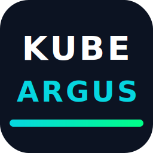

<p align="center">
  
</p>

<h1 align="center">Kube-Argus</h1>
<h3 align="center">Real-time Kubernetes Dashboard</h3>
<p align="center">A Project by <a href="https://github.com/manishchaudhary101">Manish Chaudhary</a></p>

<p align="center">
  <a href="https://github.com/manishchaudhary101/kube-argus/actions/workflows/ci.yaml"></a>
  <a href="https://github.com/manishchaudhary101/kube-argus/releases/latest"></a>
  <a href="https://github.com/manishchaudhary101/kube-argus/commits/master"></a>
  
  
  
  
  <a href="https://artifacthub.io/packages/search?repo=kube-argus"></a>
  <a href="https://github.com/manishchaudhary101/kube-argus/pkgs/container/kube-argus"></a>
  <a href="https://github.com/manishchaudhary101/kube-argus/stargazers"></a>
  <a href="https://github.com/manishchaudhary101/kube-argus/issues"></a>
  
  <a href="https://github.com/manishchaudhary101/kube-argus/blob/master/LICENSE"></a>
</p>

<p align="center">
  Live cluster state, streaming pod logs, just-in-time exec access, interactive shell, YAML editor, drain wizard, cost analysis, and AI-powered diagnostics — in a <strong>single binary</strong> with <strong>zero dependencies</strong>.
</p>

<p align="center">
  If you already use Kube-Argus, add yourself as an <a href="https://github.com/manishchaudhary101/kube-argus/issues">adopter</a>!
</p>

---

<table>
<tr>
<td width="50%">
<strong>Cluster Overview</strong> — Live node status, CPU/memory utilisation, top namespaces, and resource counts refreshed every 10 seconds.
<br><br>

</td>
<td width="50%">
<strong>Node Detail & Metrics</strong> — kubectl describe-style detail with Prometheus metrics, events, pod list, and admin actions (cordon, drain).
<br><br>

</td>
</tr>
<tr>
<td width="50%">
<strong>Pod Metrics & Logs</strong> — Per-pod CPU/memory graphs, live log streaming, container selector, and AI-powered diagnosis.
<br><br>

</td>
<td width="50%">
<strong>Spot Advisor & Cost Analysis</strong> — Spot instance risk scoring, cluster cost breakdown, and intelligent consolidation recommendations.
<br><br>

</td>
</tr>
</table>

---

## Why Kube-Argus?

Most Kubernetes dashboards show you resources. Kube-Argus gives you a **live, real-time operating picture** of your cluster — what's happening now, what it costs, and how to fix it — with the same immediacy as k9s, but in a web UI you can share with your team.

### Key Features

- 💡 **Single binary (~20 MB)** — one Go binary serves the API and React frontend; ~30 MB Docker image
- ⚡ **10-second auto-refresh** — every view updates automatically, no manual reload
- 🔒 **Zero dependencies** — no database, no CRDs, no operators, no agents on worker nodes
- 📊 **Prometheus metrics** — node, pod, and workload metrics with selectable time ranges
- 🤖 **AI-powered diagnosis** — LLM-powered pod troubleshooting with streaming responses
- 💰 **Cost analysis** — spot instance risk scoring, namespace cost allocation, consolidation recommendations
- 🖥️ **Interactive web shell** — exec into any pod over WebSocket with full terminal
- 📋 **YAML editor** — view and edit raw YAML for 11 resource kinds
- 🔐 **JIT exec access** — zero-trust shell access with approval workflow and auto-expiry
- 📝 **Audit trail** — track logins, pod deletions, scaling actions, exec sessions

### Works On

| Platform | Support Level | Notes |
|----------|:---:|---|
| **Amazon EKS** | Full | All features including Spot Advisor and cost analysis |
| **Google GKE** | Core + Metrics | All features except Spot Advisor |
| **Azure AKS** | Core + Metrics | All features except Spot Advisor |
| **Minikube / kind / k3s** | Core | All features except cloud-specific cost analysis |
| **Self-managed / on-prem** | Core + Metrics | Full functionality with Prometheus |

---

## Getting Started

### Prerequisites

- Access to a Kubernetes cluster (kubeconfig or in-cluster)
- (Optional) Prometheus endpoint for metrics
- (Optional) OIDC provider for authentication

### With Docker Compose (easiest)

```bash
docker compose up
```

Open http://localhost:8080. Edit `docker-compose.yaml` to configure auth, Prometheus, or AI.

### With Helm

```bash
helm repo add kube-argus https://manishchaudhary101.github.io/kube-argus
helm install kube-argus kube-argus/kube-argus \
  --namespace kube-argus --create-namespace \
  --set env.CLUSTER_NAME="my-cluster"
```

<details>
<summary>Alternative: OCI registry (no <code>helm repo add</code> needed)</summary>

```bash
helm install kube-argus oci://ghcr.io/manishchaudhary101/charts/kube-argus \
  --namespace kube-argus --create-namespace \
  --set env.CLUSTER_NAME="my-cluster"
```
</details>

### With plain manifests

```bash
kubectl apply -f deploy/k8s/
```

### Local Development

```bash
git clone https://github.com/manishchaudhary101/kube-argus.git
cd kube-argus
cd web && npm install && npm run build && cd ..
go run ./cmd/server
```

---

## Configuration

All configuration is via environment variables. No config files to manage.

### Core

| Variable | Default | Description |
|----------|---------|-------------|
| `PORT` | `8080` | HTTP listen port |
| `CLUSTER_NAME` | auto-detected | Display name for the cluster |
| `LOG_LEVEL` | `info` | Minimum log level (`debug`, `info`, `warn`, `error`) |

### Authentication

Auth mode is auto-detected from which env vars you set:

| Mode | When | Login screen |
|------|------|-------------|
| **Google SSO** | `GOOGLE_CLIENT_ID` is set | "Sign in with Google" button |
| **Generic OIDC** | `OIDC_ISSUER` is set | "Sign in with SSO" button |
| **None** | Neither set | No login wall, everyone gets `DEFAULT_ROLE` |

<details>
<summary>Authentication variables</summary>

#### Google SSO

| Variable | Description |
|----------|-------------|
| `GOOGLE_CLIENT_ID` | Google OAuth2 client ID |
| `GOOGLE_CLIENT_SECRET` | Google OAuth2 client secret |

#### Generic OIDC

| Variable | Default | Description |
|----------|---------|-------------|
| `OIDC_ISSUER` | — | OIDC issuer URL |
| `OIDC_CLIENT_ID` | — | OAuth2 client ID |
| `OIDC_CLIENT_SECRET` | — | OAuth2 client secret |
| `OIDC_ADMIN_GROUP` | `admin` | OIDC group claim that grants admin role |

#### Roles & Session

| Variable | Default | Description |
|----------|---------|-------------|
| `ADMIN_EMAILS` | — | Comma-separated admin email addresses |
| `DEFAULT_ROLE` | `viewer` | Role when auth is disabled: `viewer` or `admin` |
| `SESSION_SECRET` | random | HMAC key for session cookies |
| `SESSION_TTL` | `8h` | Session duration |

</details>

### Integrations

<details>
<summary>Prometheus, AI, JIT, and AWS variables</summary>

#### Prometheus Metrics

| Variable | Description |
|----------|-------------|
| `PROMETHEUS_URL` | Prometheus base URL (Grafana Cloud URLs auto-detected) |
| `PROMETHEUS_USER` | Basic auth username |
| `PROMETHEUS_KEY` | Basic auth password/API key |

#### AI Diagnosis

| Variable | Description |
|----------|-------------|
| `LLM_GATEWAY_URL` | OpenAI-compatible chat completions endpoint |
| `LLM_GATEWAY_KEY` | Bearer token for the LLM API |
| `LLM_GATEWAY_MODEL` | Model name (e.g. `gpt-4o`, `claude-3`) |

#### JIT Exec Access

| Variable | Default | Description |
|----------|---------|-------------|
| `JIT_CONFIGMAP_NAME` | `kube-argus-jit` | ConfigMap name for JIT requests |
| `AUDIT_CONFIGMAP_NAME` | `kube-argus-audit` | ConfigMap name for audit trail |
| `JIT_RETENTION_DAYS` | `7` | Days to keep terminal JIT requests |

#### AWS

| Variable | Default | Description |
|----------|---------|-------------|
| `AWS_SECRET_NAME` | — | AWS Secrets Manager secret ID |
| `AWS_REGION` | `us-east-1` | AWS region |

</details>

---

## Architecture

```
┌──────────────────────────────────────────────┐
│  Browser (React + TypeScript + Tailwind)     │
│  Recharts for metrics, xterm.js for shell    │
└──────────────┬───────────────────────────────┘
               │ HTTP / WebSocket
┌──────────────▼───────────────────────────────┐
│  Go Backend (single binary)                  │
│  ┌─────────────┐ ┌──────────┐ ┌───────────┐ │
│  │ K8s API     │ │Prometheus│ │ AWS EC2   │ │
│  │ client-go   │ │ /api/v1  │ │ Spot Price│ │
│  └─────────────┘ └──────────┘ └───────────┘ │
│  ┌─────────────┐ ┌──────────┐ ┌───────────┐ │
│  │ OIDC Auth   │ │ LLM GW   │ │ Secrets   │ │
│  │ (any IdP)   │ │ (OpenAI) │ │ Manager   │ │
│  └─────────────┘ └──────────┘ └───────────┘ │
└──────────────────────────────────────────────┘
```

---

## Cluster Impact

- **Cached**: All K8s list operations cached in-memory, refreshed every 10 seconds server-side
- **Single connection**: One set of API calls per refresh cycle, not per-user
- **No CRDs, no agents**: Nothing deployed to worker nodes
- **Low footprint**: Runs on 100m CPU / 128Mi memory

---

## Feature Comparison

| Capability | Kube-Argus | K8s Dashboard | Lens | Headlamp | k9s |
|---|:---:|:---:|:---:|:---:|:---:|
| Single binary, zero deps | ✅ | ❌ | ❌ | ❌ | ✅ |
| Docker image size | ~30 MB | ~250 MB | ~500 MB | ~200 MB | N/A |
| Shared cache (no per-user load) | ✅ | ❌ | ❌ | ❌ | ❌ |
| Live auto-refresh | ✅ | ❌ | ✅ | ✅ | ✅ |
| Streaming pod logs | ✅ | ❌ | ✅ | ✅ | ✅ |
| Web terminal (exec) | ✅ | ❌ | ✅ | ✅ | Native |
| Spot cost analysis & consolidation | ✅ | ❌ | ❌ | ❌ | ❌ |
| AI-powered pod diagnosis | ✅ | ❌ | ❌ | ❌ | ❌ |
| Resource right-sizing | ✅ | ❌ | ❌ | ❌ | ❌ |
| JIT exec access (approval workflow) | ✅ | ❌ | ❌ | ❌ | ❌ |
| Audit trail & online users | ✅ | ❌ | ❌ | ❌ | ❌ |
| Config drift detection | ✅ | ❌ | ❌ | ❌ | ❌ |
| Drain wizard with PDB preview | ✅ | ❌ | ❌ | ❌ | ❌ |
| NOC/wall screen mode | ✅ | ❌ | ❌ | ❌ | ❌ |
| Web-based (sharable) | ✅ | ✅ | ❌ | ✅ | ❌ |
| Open source (Apache 2.0) | ✅ | ✅ | Freemium | ✅ | ✅ |

---

## Features

<details>
<summary><strong>Cluster Overview</strong></summary>

- Live cluster state refreshed every 10 seconds
- Node status (Ready, NotReady, Draining, Cordoned)
- Cluster-wide CPU and memory utilisation
- Warning counts and top resource consumers by namespace
</details>

<details>
<summary><strong>Node Management</strong></summary>

- All nodes with status, instance type, capacity, and age
- `kubectl describe`-style detail with live events
- Drain wizard with PDB preview and streaming progress
- Pod heatmap for noisy neighbor detection
- Admin actions: cordon, uncordon, drain
- Per-node Prometheus metrics
</details>

<details>
<summary><strong>Workloads</strong></summary>

- Deployments, StatefulSets, DaemonSets, Jobs, CronJobs
- Restart and scale directly from the UI
- Aggregated logs from all pods in one color-coded view
- ReplicaSet history, rolling update details
- PDB status badges inline
- Resource right-sizing recommendations (7-day Prometheus data)
- Config drift detection
</details>

<details>
<summary><strong>Pod Management</strong></summary>

- Table and card views with search, filters, and sorting
- Pod sparklines (CPU/MEM trends updated every 10s)
- Live log streaming with container selector
- Previous container logs for crash debugging
- Interactive web shell via WebSocket
- AI-powered diagnosis for unhealthy pods
</details>

<details>
<summary><strong>Cost & Optimisation</strong></summary>

- Spot Advisor: risk analysis with consolidation suggestions
- Namespace-level cost allocation
- Total cluster cost panel (spot + on-demand)
</details>

<details>
<summary><strong>Security</strong></summary>

- Three auth modes: Google SSO, generic OIDC, or none
- Role-based access: admin vs viewer
- JIT exec access with approval workflow and auto-expiry
- Audit trail for all actions
- Online users with presence indicators
- Runs as non-root (`USER nobody`)
</details>

<details>
<summary><strong>More Features</strong></summary>

- Networking: Services, Ingresses with hosts/paths/TLS
- Storage: PVCs, PVs, StorageClasses with pod mapping
- Configuration: ConfigMaps, Secrets with drift detection
- YAML viewer/editor for 11 resource kinds
- Topology spread constraint validation
- Troubled pods / NOC screen with fullscreen mode
- Spot interruption tracking with resilience scoring
- Events filtered by namespace
</details>

---

## Contributing

See [CONTRIBUTING.md](CONTRIBUTING.md) for development setup and guidelines.

---

## License

This project is licensed under the Apache License 2.0 — see the [LICENSE](LICENSE) file for details.
